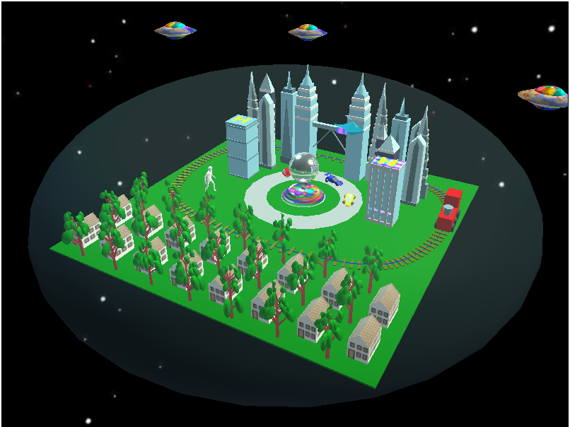

The Isolated Sky Town

This is a program of computer graphics. The project will utilize image representation, formation, presentation, composition, and manipulation; Modeling, transformation, and display of geometric objects in two and three dimensions; Representation of curves and surfaces. Rendering, animation, multi-media, and visualization. It can use the lookAt checkbox to see each specific object from the output. 

# The different kinds of objects 
   Buildings, Trees, UFO, Train, Train Track, Neon Light, Car, and Character

# The different kinds of behaviors. 
   Car, Train, Helicopter, Neon Light, Car, and UFO

# There are models loaded from the file. 
   - The .fbx file for a character and car
   - Three pictures using as textures for the ufo, house, and sculpture

# There are shaders files for creating the neon light
   - Filename: shader.vs, and shader.fs

# Look from the position above the front right of the isolated sky town. 

 
